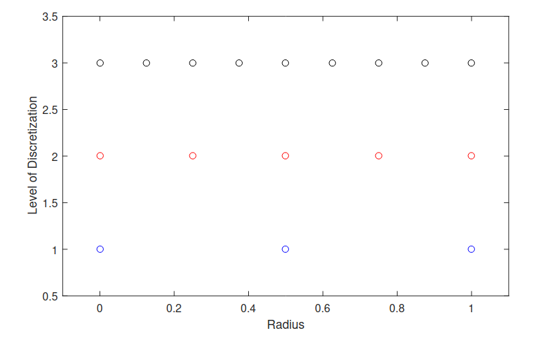
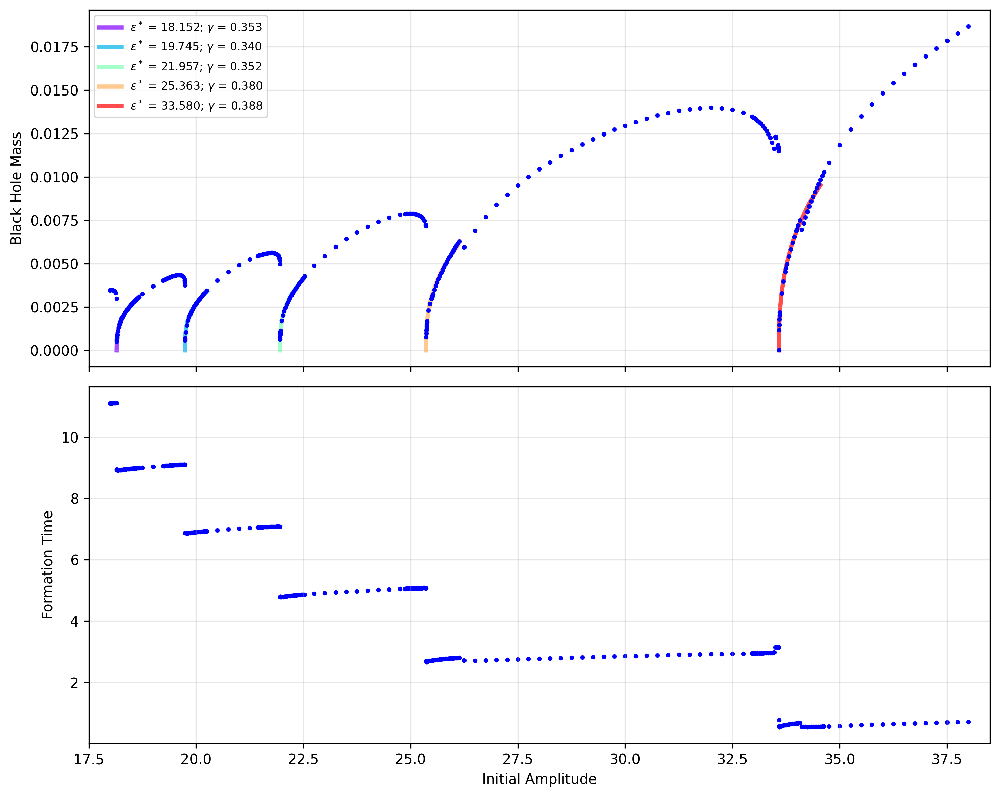

# What is Going on in this Repo?

This is a detailed, but not-too-technical explanation of the physics and computational techniques at work in this black hole simulation. It is intended for an intelligent, but general audience. Equations will be included for illustration and completeness, but you do not need to understand them to understand the discussion.

The three main references that this work is based on are:
- Matthew W. Choptuik: [Universality and scaling in gravitational collapse of a massless scalar field](https://blackholes.tecnico.ulisboa.pt/gritting/pdf/black_holes/Choptuik_Universality-and-scaling-in-gravitational-collapse-of-a-massless-scalar-field.pdf)
- M. Maliborski: [Instability of Flat Space Enclosed in a Cavity](https://arxiv.org/abs/1208.2934)
- R.-G. Cai, L.-W. Ji, and R.-Q. Yang: [On the critical behaviour of gapped gravitational collapse in confined spacetime](https://arxiv.org/abs/1609.02804v1)

## Background

In general relativity, energy curves spacetime. If enough energy is crammed into a small enough region of space, the curvature becomes so extreme that not even light can escape, and a black hole is formed. In this project, we will be studying the evolution of a wave of energy under different conditions to learn about the physical properties of systems that lead to black hole formation.

The kind of energy we're going to be working with is called a "massless scalar field." Using the common analogy of spacetime as a big rubber sheet with planets and stars as balls rolling around on it, the field we're discussing would be like ripples in the rubber caused by a fist coming down and lightly tapping the sheet.

  

  *Figure 1: The rubber sheet is our spacetime. The weight of the planets warps it, and the scalar field is like someone hitting the sheet.*

We've already established that a strong enough wave will form a black hole. This would be akin to the fist punching right through our rubber sheet. If the wave isn't strong enough to form a black hole, then the ripples will simply disperse outwards to infinity and nothing much happens. The question this project is concerned with is: **What happens if we confine our spacetime?** In other words, what happens to these small energy waves if they're not allowed to diffuse out to infinity?

## Motivation

Why on earth are we confining our spacetime like this? The answer has to do with a concept called "stability." **A spacetime is defined to be <u>un</u>stable if any amount of energy put into it, no matter how small, inevitably forms a black hole.** Stability simply means that there are configurations of the spacetime that *don't* collapse into black holes.

The flat universe that we live in is known to be stable (we said above that weak energy will simply diffuse to infinity), but there are more exotic flavours of spacetime whose stability is not known, and it is interesting to ask what changes from flatness can transition us from a stable spacetime to an unstable one. The point of this whole project is to provide evidence that confining flat spacetime is all it takes to make it unstable. This claimed instability then has implications in the study of more exotic forms of spacetime, which themselves have implications in string theory, but such discussions would take us way too far afield. All we need to concern ourselves with here is our little flat space model.

## The Problem Statement

We are trying to provide evidence that confinement takes otherwise stable flat space and makes it unstable. To do this, we will show that smaller and smaller energy packets that would not form black holes in regular flat space *will* form black holes in confined flat space.

How does this process work? To keep the math as simple as possible, we will imagine that our space and our scalar field have perfect spherical symmetry. Imagine our scalar field, which initially does not have enough energy to collapse. It starts diffusing outwards, but eventually reaches our artificial boundary. The energy of our system must be conserved, so the field has no choice but to be reflected back towards the center. Naively, one might think that this causes a stable pattern of infinite back and forth reflection: inwards, outwards, inwards, outwards, etc., but remember that energy curves spacetime! Every time the energy collapses into the center, it comes under the influence of its own self-gravity, making the energy packet a little denser. As this process repeats over and over, the energy packet becomes denser and denser until it inevitably forms a black hole, thus demonstrating instability.

Now that we have a well-posed problem, we can talk about the physics of our system.

## The Physics

**Warning: This section has math in it. You do not need to understand the math to understand the concepts.**

We said above that we are working with a massless scalar field, which we will label $\phi(t, r)$. This field obeys a seemingly simple wave equation called the massless Klein-Gordon equation:

$$
\nabla^\alpha\Delta_\alpha\phi = 0
$$

This is the equation we have to solve to track the evolution of our wave in our spacetime. If those alphas weren't there, this would be the same wave equation that governs a vibrating drum or a guitar string, but unfortunately for us they are there and they introduce a heck of a lot of complexity into an otherwise simple concept. What those alphas tell us is that our wave equation is operating in curved space, and the way that space curves is described by a spactime metric. Our spherically symmetric spacetime metric looks like this:

$$
ds^2 = -\frac{A}{N^2}dt^2 + \frac{1}{A}dr^2 + r^2d\Omega
$$

This metric tells us how spacetime warps at a local level due to the presence of our field. The function $A$ is called the radial factor, and it will be very important for determining black hole formation later. The function $N$ is called the lapse, and it tracks the gravitiational time dilation of the system. Now that we have our metric, we can resolve what's going on behind the alphas and write our Klein-Gordon equation as a pair of coupled equations, which look uglier but are much easier to work with computationally:

$$
\partial_t\phi = \frac{A\Pi}{N}
\qquad\qquad
\partial_t\Pi = \frac{A}{N}\partial_{rr}\phi + \frac{A+1}{rN}\partial_r\phi
$$

Where the conjugate momentum $\Pi=A\partial_t\phi/N$. These are the two equations that we will solve iteratively in time to evolve our wave. Unfortunately, we are not done yet because as the wave travels through spacetime, it warps the spacetime that it is moving through, which changes the way it moves, which changes how it warps spacetime, etc. This relationship is governed by the Einstein Field equations, which relate the curvature of spacetime to the matter/energy content of the system and put additional constraints on our system. For our field $\phi$ (in  units where $4\pi G = c = 1$), these take the form:

$$
G_{\mu\nu} = 2\partial_\mu\phi \partial_\nu\phi - g_{\mu\nu} \partial^\alpha\phi \partial_\alpha\phi.
$$

Translating that to the same functions we're using above and defining the mass function $m=r(1-A)/2$ and the radial gradient $\Phi=\partial_r\phi$ means that our system must satisfy:

$$
\partial_r\log N = -r(\Phi^2 + \Pi^2)
\qquad\qquad
\partial_r m = \frac{1}{2}r^2(\Phi^2 + \Pi^2)
\qquad\qquad
\partial_t m = r^2\frac{A}{N}\Phi\Pi
$$

The concept of a *mass* function may be confusing to some at first since there is no matter in our system, but remember that $E=mc^2$. In units where $c=1$, that takes on the much more evokative form of $E=m$. The mass function $m(r)$ is thus a measure of how much energy is contained in a sphere of radius $r$. If our total cavity is size 1, then $m(1)$ is the total energy of the system, which must be conserved. We will use this conservation law, along with the fact that we have two different ways of calculating mass (via the radial and temporal derivatives above), to help us prove the validity of our system later on.

We're almost done with the physics now. There are only two things left. The first is the initial profile of our scalar field. This takes the form:

$$
\phi(0, r) = 0
\qquad\qquad
\Pi(0, r) = \epsilon \exp\left(-64\tan^2\frac{\pi r}{2}\right)
$$

Where $\epsilon$ is the initial amplitude of the field that we will vary to get different effects. You will notice that all the energy of the field at the start is kinetic. It's in the momentum equation, and the field itself is zero. That's why we chose the metaphor of the hand punching the rubber sheet. The simulation starts the moment the fist makes contact with the sheet.

The last thing we need is to understand when a black hole has formed. This happens when enough mass is contained in a small enough radius such that the Schwarzschield condition is met:

$$
\frac{2m}{r} = 1
$$

As you might expect, the simulation gets a little messy when this happens. In particular, our radial factor $A$ goes to zero, causing the $dr$ component of our metric to diverge, and blasting the local curvature off to infinity. This breaks our simulation. To avoid this nastiness, we instead define black hole formation at

$$
\frac{2m}{r} = 0.99
$$

This is about as close to formation as we can get in our simulation before the whole thing goes off the rails. There exist fancy techniques for moving closer to black hole formation and even beyond it by excising the horizon out of your simulation, but this approximation is good enough to resolve the behaviour that we care about.

This completes our mathematical model. Congratulations to you if you've made it this far. Next we will discuss how we turn this model into code and move through time.

## The Code

The physical model we have built is continuous, but our computer model operates discretely. This section will explain how we break our physical model into a grid of space and time that we can work on computationally with guaranteed error bounds.

### The Spatial Grid

The first step is creating a spatial grid. Our various functions are operating in a sphere of radius 1. We will thus take the radial points from 0 to 1 and approximate them by a grid of $2^\ell + 1$ points, where $\ell$ is called the level of discretization. Increasing $\ell$ roughly doubles the number of points that are in the grid. Higher $\ell$ means a better approximation to our physical model, but increased computational demand. Why $2^\ell + 1$ points? A diagram comparing $\ell = 1, 2, 3$ will make it more clear:

  

  *Figure 2: A comparison of the grid points for $\ell = 1, 2, 3$. The even numbered points from level $\ell$ are exactly the points of level $\ell - 1$.*

As you can see in the figure above, taking every other point from discretization $\ell$ gives the points from discretization $\ell - 1$. We can therefore compare our approximations at the same radial points across levels by looking at a subset of the points. This will enable us to do our error analysis later on.

Now that we have our grid, our continuous physical functions just become vectors of length $2^\ell + 1$, valued by the respective function's value at those grid points. Derivatives of our vectors are calculated via the [finite difference approximation](https://en.wikipedia.org/wiki/Finite_difference). This is all we need to set up our initial conditions. Now we need to evolve the system in time.

### Timestepping

To move our simulation forward in time, we will use [a common integration technique called RK4](https://en.wikipedia.org/wiki/Runge%E2%80%93Kutta_methods). The details of this technique are beyond the scope of this discussion, but in essence what we are doing is taking a very tiny step $\Delta t$ forward in time, re-evaluating our equations, taking another step, re-evaluating, etc. If our spatial grid size is $\Delta x = 2^{-l}$, then we require $\Delta t < \Delta x$ for the whole system to remain stable. In our case, we can get away with $\Delta t = 0.95 \Delta x$ most of the time, but we drop the simulation speed by a factor of four very close to black hole formation to improve stability there.

Technical aside: If you're curious about how this timestepping interacts with gravitational time dilation, the answer is in our lapse function $N$. There is a degree of freedom in the scale of $N$, corresponding to our ability to choose a reference frame. By defining $N(1) = 1$, we make it so that our measured time $t$ is the proper time at $r=1$.

### Time Complexity, Error, and Choosing $\ell$

We have everything we need to build our simulation. All we need to do now is pick the level of discretization that we will work at. All of our differentiation and integration operators operate at fourth order accuracy. What this means is that if you double the fidelity of your approximation (i.e. increase $\ell$ by 1), your error will go down by a factor of $2^4=16$. This order of accuracy is considered table stakes for most scientific computing applications. You wouldn't want your simulation to be any less accurate than that if you were going to publish it.

Practically speaking, what this means is that around $\ell=14$ (around 8000 grid points) we reach the limits of floating point precision in our error analysis. Going higher than that may seem unnecessary at first glance, but it can still be useful for resolving high frequency limiting behaviour very near the critical points. Research papers in this field operate closer to $\ell=17$ (around 64,000 points).

There are two issues with increasing $\ell$ too much, however. The first issue is simply time. Increasing $\ell$ doubles the number gridpoints, and thus the number of computations we have to do per timestep, and since $\Delta t \sim \Delta x$, it also doubles the number of timesteps. This makes the whole algorithm $\mathcal{O}(4^\ell)$, which is pretty nasty.

The other issue is the floating point issue we mentioned above. Once your simulation error drops far enough that floating point errors become the dominant error mode in your calculation, you end up with a lot of non-physical high frequency noise arising. This can build over time and destabilize your simulation. The solution to this in the code is an artifical dissipation term, which operates at the noise level (at 5th order, below our signal), and acts as a low-pass filter, eliminating the high frequency noise.

In the results shown below, I used $\ell=15$ (around 16,000 grid points). This was about as high as I could go while still being able to collect all the data in a single day. Part of me wanted to go higher, but this is already 4x more accurate than my actual undergrad thesis results were, and I didn't want to spend two weeks collecting data.

## Results

### The Main Results

We have everything we need now, so let's visualize a few simulations. This first one is at amplitude $\epsilon=35$ and collapses immediately into a black hole (the sharp ring at the end of the video is the horizon):

https://github.com/user-attachments/assets/2e2b00d9-4553-428c-b7d1-1d953cc10d7e

Here is one at $\epsilon=21.5$, which reflects three times before collapsing

https://github.com/user-attachments/assets/14f942d7-7f00-4730-b5a3-60897e2be5a6

The 2D visualizations look a lot sleeker, but let's look at that same $\epsilon=21.5$ in one dimension (just the radius) to watch the wave profile sharpen more clearly at each implosion:

https://github.com/user-attachments/assets/77f3c00b-c35e-4e02-b4d3-b4a90091a13a

That gives us an idea of how individual runs look, but what does the overall picture look like across a range of amplitudes? I knew from my previous work that the range of interest for this study was between $\epsilon = 18$ and $38$, so I started by doing a scan of that range every 0.25 units. This revealed the overall pattern we were looking for. I then did a closer scan of 40 points at $\pm 3\%$ of each critical point to resolve the scaling behaviour, and then ten more points really close to each estimated critical point to narrow them down even more. The final results look like this:

  

  *Figure 3: The final results showing the critical scaling behaviour.*

The rightmost mass curve at the highest initial amplitude corresponds to fields that immediately formed a black hole without reflection. The second curve from the right is one reflection off the boundary, then two for the third curve, and so on.

A fit of $M_{bh} \propto (\epsilon - \epsilon^*)^\gamma$ was performed near each critical amplitude $\epsilon^*$, and the resulting $\gamma$ values cluster nicely around Choptuik's universal value of $\gamma \approx 0.37$.

### Error Analysis
