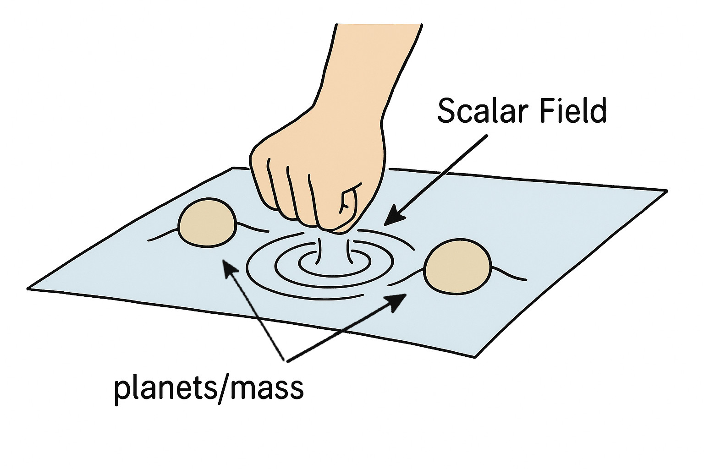

# What is Going on in this Repo?

This is a detailed, but not-too-technical explanation of the physics and computational techniques at work in this black hole simulation. It is intended for an intelligent, but general audience. Equations will be included for illustration and completeness, but you do not need to understand them to understand the discussion.

## Background

In general relativity, energy curves spacetime. If enough energy is crammed into a small enough region of space, the curvature becomes so extreme that not even light can escape, and a black hole is formed. In this project, we will be studying the evolution of a wave of energy under different conditions to learn about the physical properties of systems that lead to black hole formation.

The kind of energy we're going to be working with is called a "massless scalar field." Using the common analogy of spacetime as a big rubber sheet with planets and stars as balls rolling around on it, the field we're discussing would be like ripples in the rubber caused by a fist coming down and lightly tapping the sheet.

  

  <table style="width: 600px;">
    <tr>
      <td>
        Figure 1: The rubber sheet is our spacetime. The weight of the planets warps it, and the scalar field is like someone hitting the sheet.
      </td>
    </tr>
  </table>

We've already established that a strong enough wave will form a black hole. This would be akin to the fist punching right through our rubber sheet. If the wave isn't strong enough to form a black hole, then the ripples will simply disperse outwards to infinity and nothing much happens. The question this project is concerned with is: **What happens if we confine our spacetime?** In other words, what happens to these small energy waves if they're not allowed to diffuse out to infinity?

## Motivation

Why on earth are we confining our spacetime like this? The answer has to do with a concept called "stability." **A spacetime is defined to be <u>un</u>stable if any amount of energy put into it, no matter how small, inevitably forms a black hole.** Stability simply means that there are configurations of the spacetime that *don't* collapse into black holes.

The flat universe that we live in is known to be stable (we said above that weak energy will simply diffuse to infinity), but there are more exotic flavours of spacetime whose stability is not known, and it is interesting to ask what changes from flatness can transition us from a stable spacetime to an unstable one. The point of this whole project is to provide evidence that confining flat spacetime is all it takes to make it unstable. This claimed instability then has implications in the study of more exotic forms of spacetime, which themselves have implications in string theory, but such discussions would take us way too far afield. All we need to concern ourselves with here is our little flat space model.

## The Problem Statement

We are trying to provide evidence that confinement takes otherwise stable flat space and makes it unstable. To do this, we will show that smaller and smaller energy packets that would not form black holes in regular flat space *will* form black holes in confined flat space.

How does this process work? To keep the math as simple as possible, we will imagine that our space and our scalar field have perfect spherical symmetry. Imagine our scalar field, which initially does not have enough energy to collapse. It starts diffusing outwards, but eventually reaches our artificial boundary. The energy of our system must be conserved, so the field has no choice but to be reflected back towards the center. Naively, one might think that this causes a stable pattern of infinite back and forth reflection: inwards, outwards, inwards, outwards, etc., but remember that energy curves spacetime! Every time the energy collapses into the center, it comes under the influence of its own self-gravity, making the energy packet a little denser. As this process repeats over and over, the energy packet becomes denser and denser until it inevitably forms a black hole, thus demonstrating instability.

Now that we have a well-posed problem, we can talk about the physics of our system.

## The Physics

**Warning: This section has math in it. You do not need to understand the math to understand the concepts.**

We said above that we are working with a massless scalar field. We will label our field $\phi(t, r)$, and $\phi$ obeys a seemingly simple wave equation called the massless Klein-Gordon equation:

$$
\nabla^\alpha\Delta_\alpha\phi = 0
$$

This is the equation we have to solve to track the evolution of our wave in our spacetime. If those alphas weren't there, this would be the same wave equation that governs a vibrating drum or a guitar string, but unfortunately for us they are there and they introduce a heck of a lot of complexity into an otherwise simple concept. What those alphas tell us is that our wave equation is operating in curved space, and the way that space curves is described by a spactime metric. Our spherically symmetric spacetime metric looks like this:

$$
ds^2 = -\frac{A}{N^2}dt^2 + \frac{1}{A}dr^2 + r^2d\Omega
$$

This metric tells us how spacetime warps at a local level due to the presence of our field. The function $A$ is called the radial factor, and it will be very important for determining black hole formation later. The function $N$ is called the lapse, and it tracks the gravitiational time dilation of the system. We will define these more properly in a moment. Now that we have our metric, we can write our Klein-Gordon equation as a pair of coupled equations which look uglier but are much easier to work with computationally:

$$
\partial_t\phi = \frac{A\Pi}{N}
\qquad\qquad
\partial_t\Pi = \frac{A}{N}\partial_{rr}\phi + \frac{A+1}{rN}\partial_r\phi
$$

Where the conjugate momentum $\Pi=A\partial_t\phi/N$. These are the two equations that we will solve iteratively in time to evolve our wave. Unfortunately, we are not done yet because as the wave travels through spacetime, it warps the spacetime that it is moving through, which changes the way it moves, which changes how it warps spacetime, etc. This relationship is governed by the Einstein Field equations, which relate the curvature of spacetime to the matter/energy content of the system and put additional constraints on our system. For our field $\phi$ (in  units where $4\pi G = c = 1$), these take the form:

$$
G_{\mu\nu} = 2\partial_\mu\phi \partial_\nu\phi - g_{\mu\nu} \partial^\alpha\phi \partial_\alpha\phi.
$$

Translating that to the same functions we're using above and defining the mass function $m=r(1-A)/2$ and the radial gradient $\Phi=\partial_r\phi$ means that our system must satisfy:

$$
\partial_r\log N = -r(\Phi^2 + \Pi^2)
\qquad\qquad
\partial_r m = \frac{1}{2}r^2(\Phi^2 + \Pi^2)
\qquad\qquad
\partial_t m = r^2\frac{A}{N}\Phi\Pi
$$

The concept of a *mass* function may be confusing to some at first since there is no matter in our system, but remember that $E=mc^2$. In units where $c=1$, that takes on the much more evokative form of $E=m$. The mass function $m(r)$ is thus a measure of how much energy is contained in a sphere of radius $r$. If our total cavity is size 1, then $m(1)$ is the total energy of the system, which must be conserved. We will use this conservation law, along with the fact that we have two different ways of calculating mass (via the radial and temporal derivatives above), to help us prove the validity of our system later on.

We're almost done with the physics now. There are only two things left. The first is the initial profile of our scalar field. This takes the form:

$$
\phi(0, r) = 0
\qquad\qquad
\Pi(0, r) = \epsilon \exp\left(-64\tan^2\frac{\pi r}{2}\right)
$$

That is to say, all the energy of the field at the start is kinetic. It's in the momentum equation. That's why we chose the metaphor of the hand punching the rubber sheet. The simulation starts the moment the fist makes contact with the sheet.

The last thing we need is to understand when a black hole has formed. Mathematically, this happens when enough mass is contained in a small enough radius such that the Schwarzschield condition is met:

$$
\frac{2m}{r} = 1
$$

As you might expect, the simulation gets a little messy when this happens. In particular, our radial factor $A$ goes to zero, causing the $dr$ component of our metric to diverge, and blasting the local curvature off to infinity. This breaks our simulation. To avoid this nastiness, we instead define black hole formation at

$$
\frac{2m}{r} = 0.99
$$

There exist fancy techniques for moving closer to black hole formation and excising the horizon out of your simulation, but for our purposes this approximation is good enough to resolve the behaviour that we care about.

This completes our mathematical model. Congratulations to you if you've made it this far. Next we will discuss how we turn this model into code and move through time.

## The Code

### The Grid

### Timestepping

## Results

### The Main Results

### Error Analysis
